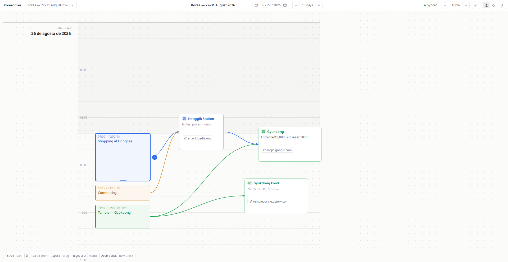

# Koreandres

## A whiteboard for planning trips.




## Running it

You'll need Node 20.19 or newer, which is what Vite 8 asks for.

```bash
git clone https://github.com/andresdanielmtz/koreandres.git
cd koreandres
npm install
npm run dev
```

That's enough to start using it. With no Supabase configured it saves to your
browser's local storage, and the toolbar says `Local only` so you know where
your boards are going. Fine for a look around, but they live in that one
browser and nowhere else.

For boards that follow you between machines, copy `.env.example` to `.env`,
point it at a Supabase project and run one SQL script.
[docs/setup.md](docs/setup.md) walks through it. It takes a couple of minutes.

The map pane wants one more line in that same `.env`:

```
VITE_GOOGLE_MAPS_API_KEY=your-key
```

A Google Cloud API key with two APIs enabled on it: **Maps JavaScript API** to
draw the map, and **Geocoding API** to turn a place you've typed into somewhere
to fly to. One thing it can't do: the short `maps.app.goo.gl` links the share
button gives you only resolve by following their redirect, which a page with no
server of its own isn't allowed to do. Open one and paste the full link it
lands on, or just the name of the place. Without it the app still runs; the pane tells you which variable is
missing and every location keeps its link out to Google Maps. Setting one up,
and restricting it so it can't be lifted out of the bundle, is in
[docs/setup.md](docs/setup.md#setting-up-the-map).

## Licence

MIT. See [LICENSE](LICENSE).
